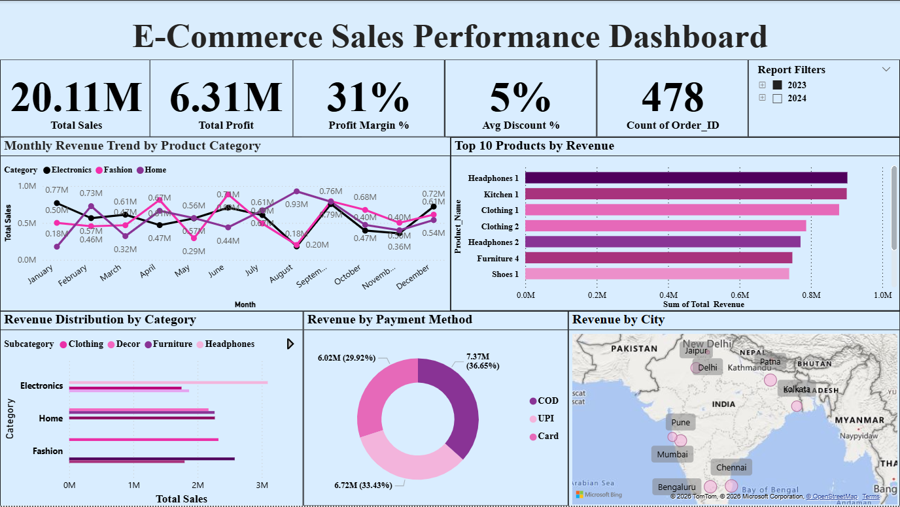

# E-Commerce Sales Performance Dashboard

Interactive Power BI dashboard analyzing e-commerce sales performance, product trends, payment methods, and regional sales distribution.

## Tools Used
- Power BI
- DAX
- Excel

## Dashboard Preview

## Key Insights
- Electronics category generates the highest revenue
- Card payments account for the largest share of transactions
- Mumbai and Delhi lead in total sales
